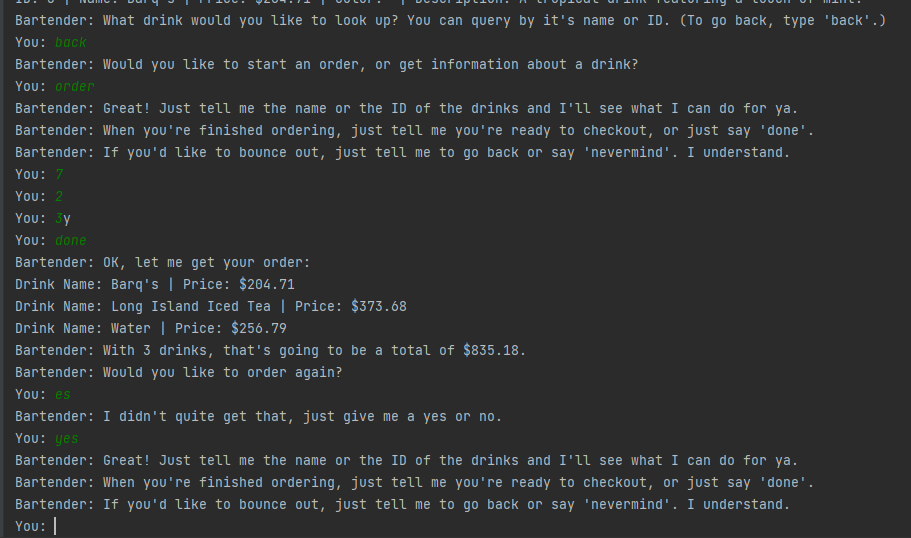

# CIS3368 Assignment 1: Drink Order Manager

Created by Erica Miller (2031854) for the Spring 2024 semester.

## Features

Purchase suspiciously overpriced drinks from the Bartender!


- Drink entries, including their name, potential "color", description, and price were generated randomly using **DrinkGenerator.** (utils/DrinkGenerator.py)

- Drinks were given a 60% chance of having a random "color" attribute, and a 90% chance of getting a randomized description.



- Input can either be the name of a drink on the menu or the unique ID of a drink.

- Drink names are not case-sensitive when querying them from the Bartender.

- The bartender doesn't shut up unless you tell him to, or forcibly close the process.

## Installation

This program was made with the SQLAlchemy and MySQL connector packages.

Ensure you have the required dependencies downloaded by running the following command in this directory:

```
python -m pip install -r requirements.txt
```

## Usage

First, take a look at ``config/Config.py`` and check if the ``CONNECTION_MODE`` is what you intend.
The default value is ``REMOTE_SERVER``, which is the AWS server -- our final presenting database.
Other values such as ``LOCAL_FILE`` and ``LOCAL_MEMORY`` can be used for testing purposes.

Keep in mind that the program, including the utility and interface code, will interact with the database 
as determined by ``CONNECTION_MODE``.

To start the show, you can simply run:
```
python main.py
```

To generate arbitrary drinks into a database, you can run the following:
```
python -m utils.DrinkGenerator
```

---

[](https://classroom.github.com/a/gdwPe-ZR)
